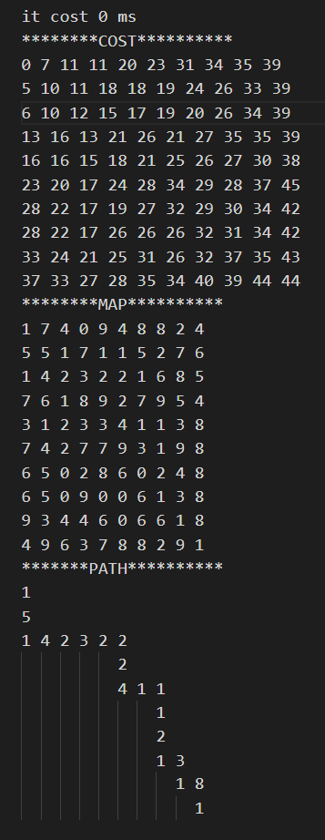

## 算法解谜题

### [数独](sudoku)
回溯法进行数独谜题的解决，详情可见文章：[回溯法求解数独问题](https://www.motwo.cn/article/60b9d79f93e18556c43b020c)

### [数字华容道（8/15数码）](15Puzzle)
利用搜索算法进行复原方法的求解，目前实现了： 
- 广度优先算法(BFS)

### [A*寻路](astar)
生成矩阵的map，随机生成路径的代价cost，通过A*算法进行起点到终点的路径寻优




TODO:
- 增加障碍方格
- 在把节点加入OPEN（待探索节点时），按序存放，便于之后寻找当前OPEN中的最小路径
    - 目前可用更好的数据结构：堆
    > The heap is one maximally efficient implementation of an abstract data type called a priority queue. A heap is a useful data structure when it is necessary to repeatedly remove the object with the highest (or lowest) priority.
     --[wiki](https://en.wikipedia.org/wiki/Heap_%28data_structure%29)    

    原本通过遍历存放OPEN的map，记录找到的最小cost
    ```cpp
            for(int i=1;i<open.size();i++){
            auto item=open[i];
            if(item.second<minCost){
                minCost=item.second;
                current=item.first;
                minSite=i;
            }
        }


    ```
- 更快捷找到各点的路径导航

#### heap  

