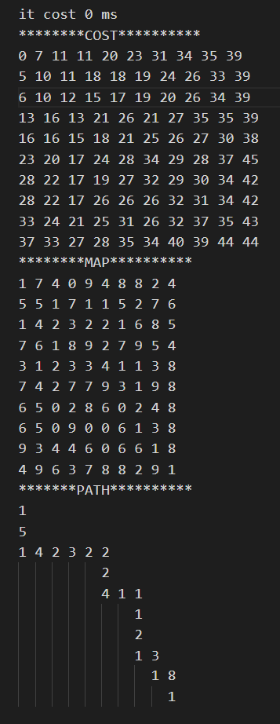

## [A*寻路](.)
生成矩阵的map，随机生成路径的代价cost，通过A*算法进行起点到终点的路径寻优



TODO:
- 增加障碍方格
- 在把节点加入OPEN（待探索节点时），按序存放，便于之后寻找当前OPEN中的最小路径
    - 目前可用更好的数据结构：堆
    > The heap is one maximally efficient implementation of an abstract data type called a priority queue. A heap is a useful data structure when it is necessary to repeatedly remove the object with the highest (or lowest) priority.
     --[wiki](https://en.wikipedia.org/wiki/Heap_%28data_structure%29)    

    原本通过遍历存放OPEN的map，记录找到的最小cost
    ```cpp
            for(int i=1;i<open.size();i++){
            auto item=open[i];
            if(item.second<minCost){
                minCost=item.second;
                current=item.first;
                minSite=i;
            }
        }


    ```
- 更快捷找到各点的路径导航

### heap  
``` cpp
#include<iostream>
#include "include/heap.h"
using namespace std;
int main(void){
    SortHeap foo;
    foo.add_min(NodeType(3,5));
    foo.add_min(NodeType(9,5));
    foo.add_min(NodeType(2,5));
    foo.add_min(NodeType(4,5));
    cout<<foo<<endl;
    while(foo.size>0){
        cout<<foo.extract_min()<<endl;
        foo.delete_min();
    }
}

```
output 
```
 0 1 2 3
 2 4 3 9
         2
         4         3
       9
2
3
4
9
```


## 性能比较

使用heap减少了对最小值的挑选，但是在整堆过程也有损耗，因此效果并没有想象中好

``` cpp
#include<iostream>
#include<ctime>
#include "include/astar.h"
using namespace std;
int main(void){

    int size=99;
    MapGraph randomMap(size);
    time_t time_s;
    
    time_s=clock();
    randomMap.astar();
    cout<<"INIT cost " << (double )(clock() - time_s) <<" ms"<<endl;
    randomMap=MapGraph(size);
    time_s=clock();
    randomMap.astar_heap();
    cout<<"HEAP cost " << (double )(clock() - time_s) <<" ms"<<endl;
    randomMap=MapGraph(size);
    time_s=clock();
    randomMap.astar();
    cout<<"INIT cost " << (double )(clock() - time_s) <<" ms"<<endl;
    randomMap=MapGraph(size);
    time_s=clock();
    randomMap.astar_heap();
    cout<<"HEAP cost " << (double )(clock() - time_s) <<" ms"<<endl;
    return 0;
}
```

output
``` 
INIT cost 30 ms
HEAP cost 31 ms
INIT cost 245 ms
HEAP cost 235 ms
```

## 将Heap改为模板类

其中涉及到：
- 模板类的声明
    - 成员函数
    - 友元函数
- 模板类继承模板类
    - 继承模板成员和成员函数（3种方式）

1. 类的定义前面使用关键词：template <class T>或多维类模板 template<class T, int dim>
2. 函数的实现部分，在每个函数名的上一行也要加关键词template <class T，int dim>， 并且在函数名后面添加<T, dim>

由于C++的模板不是泛型，需要在编译时根据模板的类型进行编译，需要隐式实例化使用该特定类型的模板类(如`vector<int>`)，若这个在头文件中没有声明，则编译无法通过(`undefined reference to xxx`)，这里我将模板类的定义都放在一个头文件`heap.h`中，以解决该问题


## reference
- [类模板的继承](https://blog.csdn.net/gaoyongfei001/article/details/81034839)   
- [C++: 模板类编译过程中出现“undefined reference to”问题](https://itachi666.github.io/posts/bfee53d1/) 